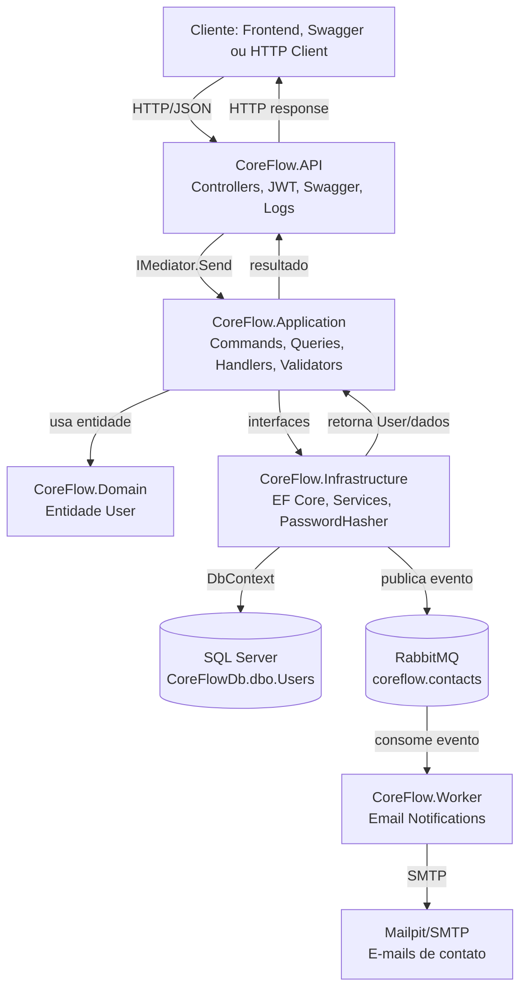
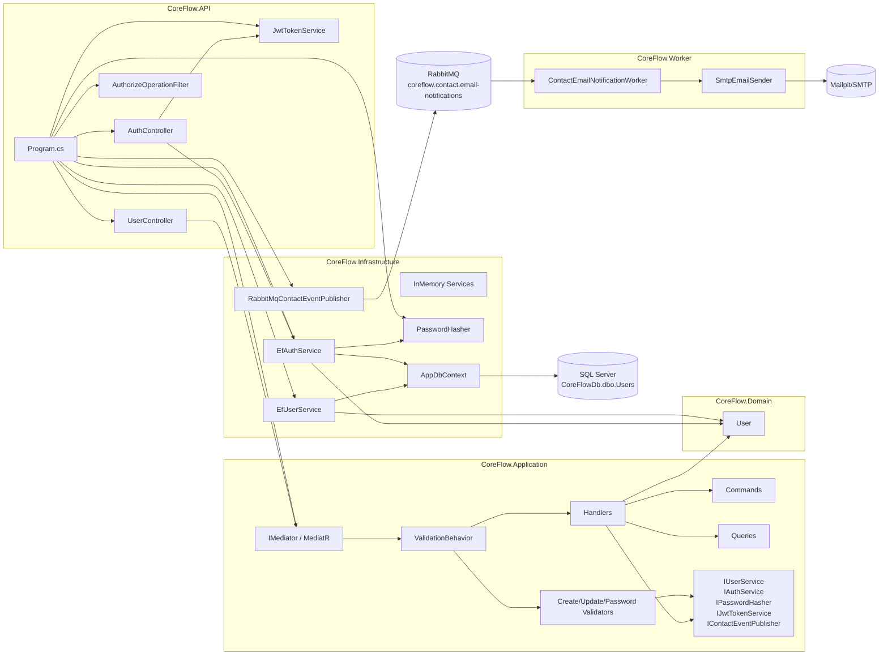
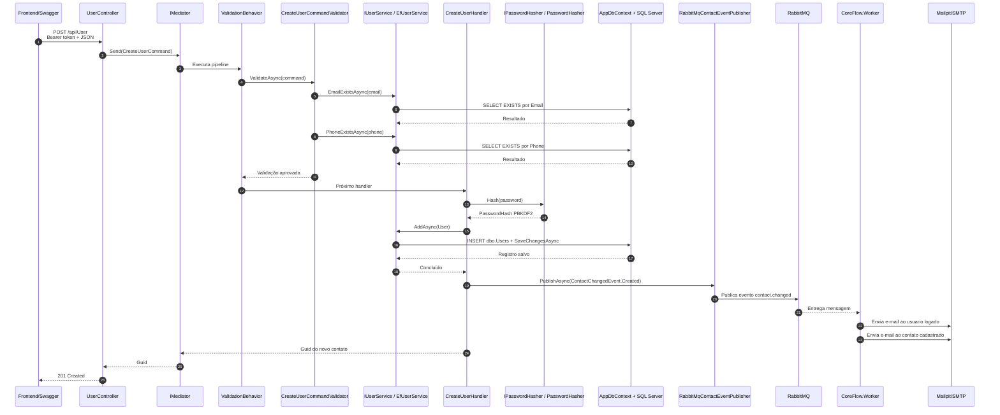
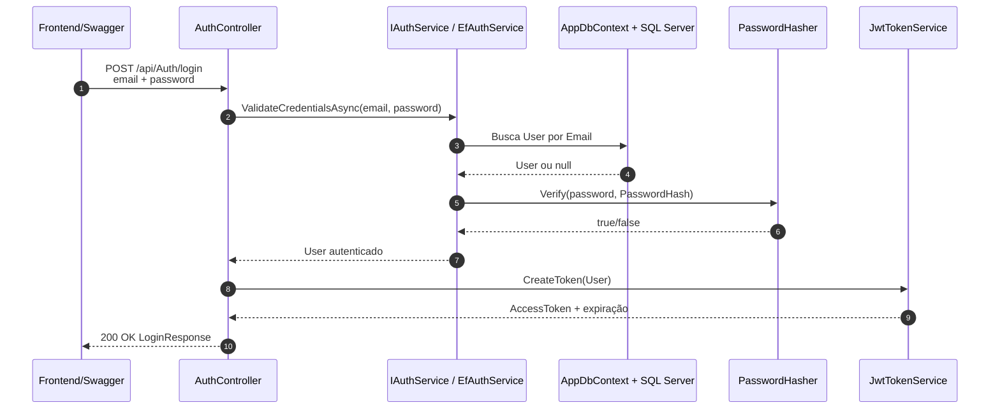

# Documentação técnica - CoreFlow Backend

Gerado em: 16/05/2026

## 1. Visão geral

O CoreFlow é o backend da Agenda de Contatos. Ele foi desenvolvido em ASP.NET Core com .NET 10 e expõe uma API HTTP para autenticação JWT e CRUD de contatos.

No código do backend, o contato da agenda é representado pela entidade `User`. Por isso, os endpoints aparecem como `/api/User`, mas no contexto funcional da aplicação eles atendem ao cadastro, consulta, edição, exclusão e listagem dos contatos da agenda.

A aplicação usa SQL Server como banco de dados principal, Entity Framework Core como ORM, MediatR para CQRS, FluentValidation para regras de validação, RabbitMQ para eventos assíncronos, um Worker .NET para envio de e-mails, Swagger/OpenAPI para documentação dos endpoints, Serilog para logs, Docker para empacotamento e xUnit para testes automatizados.

## 2. Tipo de arquitetura utilizada

O projeto usa uma arquitetura em camadas com separação de responsabilidades e aplicação de CQRS com MediatR.

Ela não é uma Clean Architecture completa em todos os detalhes formais, mas segue uma organização parecida: a API recebe a requisição, a camada de aplicação executa casos de uso por commands, queries, handlers e validators, o domínio concentra a entidade principal, e a infraestrutura implementa banco de dados, persistência e segurança.

Camadas principais:

| Camada | Responsabilidade | Onde está |
| --- | --- | --- |
| API | Entrada HTTP, controllers, Swagger, autenticação, autorização, logs, injeção de dependência e composição da aplicação. | `CoreFlow.API` |
| Application | Regras de aplicação, commands, queries, handlers, validators, interfaces e pipeline de validação. | `CoreFlow.Application` |
| Domain | Entidades de domínio. | `CoreFlow.Domain` |
| Infrastructure | EF Core, `DbContext`, serviços concretos, migrations, persistência e hash de senha. | `CoreFlow.Infrastructure` |
| Worker | Consome eventos do RabbitMQ e envia e-mails por SMTP quando contatos são criados, atualizados ou removidos. | `CoreFlow.Worker` |
| Tests | Testes unitários de domínio, validação, autenticação e regras principais. | `CoreFlow.Tests` |

Fluxo arquitetural resumido:

1. O cliente chama um endpoint HTTP.
2. O controller recebe a requisição.
3. Em endpoints de agenda, o controller envia um command ou query para o MediatR.
4. O pipeline de validação executa os validators do FluentValidation.
5. O handler executa o caso de uso.
6. O handler usa interfaces da aplicação, como `IUserService` ou `IPasswordHasher`.
7. A infraestrutura implementa essas interfaces com EF Core, SQL Server e PBKDF2.
8. Após criar, editar ou remover contato, o handler publica um evento de contato no RabbitMQ.
9. O Worker consome o evento e envia e-mails ao usuário logado e ao contato afetado por SMTP.
10. O resultado volta para o controller e é convertido em resposta HTTP.

## 3. Diagrama da arquitetura



## 4. Tecnologias do backend e onde são utilizadas

### .NET 10 e ASP.NET Core

O .NET 10 é a plataforma usada para compilar e executar a API. O ASP.NET Core é o framework web usado para criar controllers, middlewares, autenticação, autorização e endpoints HTTP.

| Uso | Onde está |
| --- | --- |
| Projeto web da API | `CoreFlow.API/CoreFlow.API.csproj` |
| Configuração da aplicação | `CoreFlow.API/Program.cs` |
| Controllers HTTP | `CoreFlow.API/Controllers/AuthController.cs`, `CoreFlow.API/Controllers/UserController.cs` |
| Configurações locais de execução | `CoreFlow.API/Properties/launchSettings.json` |

### C# com records, nullable e implicit usings

O projeto usa recursos modernos de C#, como `record` para DTOs, commands e queries, `nullable` habilitado e `implicit usings` habilitado nos projetos `.csproj`.

| Uso | Onde está |
| --- | --- |
| Commands e queries como records | `CoreFlow.Application/Commands`, `CoreFlow.Application/Queries` |
| Entidade `User` como record | `CoreFlow.Domain/Entities/User.cs` |
| DTOs de autenticação como records | `CoreFlow.API/Controllers/AuthController.cs` |

### MediatR

MediatR implementa o fluxo CQRS. Controllers não chamam diretamente a persistência nos endpoints de agenda; eles enviam commands ou queries para handlers.

| Tipo | Classes |
| --- | --- |
| Commands | `CreateUserCommand`, `UpdateUserCommand`, `DeleteUserCommand`, `ChangeOwnPasswordCommand` |
| Queries | `GetAllUsersQuery`, `GetUserByIdQuery` |
| Handlers | `CreateUserHandler`, `UpdateUserHandler`, `DeleteUserHandler`, `ChangeOwnPasswordHandler`, `GetAllUsersHandler`, `GetUserByIdHandler` |
| Registro no container | `builder.Services.AddMediatR(...)` em `Program.cs` |

### FluentValidation

FluentValidation valida os commands antes de os handlers executarem as regras de persistência.

| Validator | Responsabilidade |
| --- | --- |
| `CreateUserCommandValidator` | Valida nome, e-mail, telefone, senha e duplicidade de e-mail/telefone. |
| `UpdateUserCommandValidator` | Valida id, nome, e-mail, telefone e duplicidade ignorando o próprio usuário editado. |
| `ChangeOwnPasswordCommandValidator` | Valida senha atual obrigatória e nova senha com no mínimo 8 caracteres. |
| `ValidationBehavior<TRequest,TResponse>` | Pipeline do MediatR que executa os validators antes dos handlers. |

### Entity Framework Core

EF Core é o ORM usado para mapear a entidade `User` para a tabela `dbo.Users` no SQL Server.

| Uso | Onde está |
| --- | --- |
| `DbContext` | `CoreFlow.Infrastructure/Data/AppDbContext.cs` |
| Mapeamento de colunas, tamanhos e índices | `AppDbContext.OnModelCreating` |
| Serviços com acesso ao banco | `EfUserService`, `EfAuthService` |
| Migrations | `CoreFlow.Infrastructure/Migrations` |

### SQL Server 2022

O SQL Server é executado em container Docker com a imagem `mcr.microsoft.com/mssql/server:2022-latest`.

| Item | Valor |
| --- | --- |
| Serviço no Docker Compose | `db` |
| Nome do container | `coreflow_sql` |
| Porta publicada no host | `1433:1433` |
| Banco | `CoreFlowDb` |
| Tabela principal | `dbo.Users` |

### JWT Bearer

JWT é usado para autenticar e autorizar chamadas protegidas. O login retorna um token e os endpoints de agenda exigem `Authorization: Bearer <token>`.

| Uso | Onde está |
| --- | --- |
| Configuração JWT | `CoreFlow.API/Options/JwtOptions.cs`, `appsettings.json`, `docker-compose.yml` |
| Geração de token | `CoreFlow.API/Services/JwtTokenService.cs` |
| Validação de token | `Program.cs`, com `AddAuthentication().AddJwtBearer(...)` |
| Proteção de rotas | `[Authorize]` em `UserController` e `Authenticate` |

### PBKDF2-SHA256

As senhas não são salvas em texto puro. O projeto usa PBKDF2 com SHA-256, salt aleatório de 16 bytes, hash de 32 bytes e 100.000 iterações.

| Uso | Onde está |
| --- | --- |
| Hash e verificação de senha | `CoreFlow.Infrastructure/Security/PasswordHasher.cs` |
| Cadastro de usuário/contato | `CreateUserHandler` |
| Login | `EfAuthService.ValidateCredentialsAsync` |
| Troca de senha | `ChangeOwnPasswordHandler` |

### Swagger/OpenAPI

A documentação dos endpoints é feita com Swagger/OpenAPI usando Swashbuckle.

| Uso | Onde está |
| --- | --- |
| Geração do documento OpenAPI | `builder.Services.AddSwaggerGen(...)` em `Program.cs` |
| Interface Swagger UI | `app.UseSwaggerUI(...)` em `Program.cs` |
| Informações da API | `OpenApiInfo` em `Program.cs` |
| Segurança Bearer no Swagger | `AddSecurityDefinition("Bearer", ...)` |
| Marcação automática de endpoints protegidos | `CoreFlow.API/Swagger/AuthorizeOperationFilter.cs` |
| Comentários XML | `GenerateDocumentationFile` em `CoreFlow.API.csproj` e `IncludeXmlComments` em `Program.cs` |

### Serilog

Serilog registra logs no console e em arquivos diários dentro de `logs`.

| Uso | Onde está |
| --- | --- |
| Configuração global de logs | `Program.cs` |
| Arquivos de log | `CoreFlow.API/logs/coreflow-.log` no container/app |
| Volume Docker | `./CoreFlow.API/logs:/app/logs` |

### Docker e Docker Compose

Docker empacota a API e o Worker. Docker Compose orquestra API, Worker, RabbitMQ, Mailpit, SQL Server e o container auxiliar de inicialização do banco.

| Arquivo | Função |
| --- | --- |
| `Dockerfile` | Build multi-stage: SDK .NET 10 para publicar e runtime ASP.NET 10 para executar. |
| `docker-compose.yml` | Sobe `api`, `worker`, `rabbitmq`, `mailpit`, `db` e `db-init`. |
| `docker/sql/init.sql` | Cria banco, tabela, índices e registros iniciais. |

### RabbitMQ

RabbitMQ é usado como broker de mensagens para desacoplar o CRUD de contatos do envio de e-mails. A API não envia o e-mail diretamente durante a requisição; ela salva a alteração no SQL Server e publica um evento no RabbitMQ.

Cada evento leva os dados do contato afetado e os dados do usuário logado que executou a ação. O Worker usa essas informações para enviar duas mensagens:

| Destinatário | Mensagem |
| --- | --- |
| Usuário logado | Confirma que ele cadastrou, alterou ou removeu o contato, com os dados envolvidos. |
| Contato afetado | Informa que ele foi adicionado, alterado ou removido pelo usuário logado. |

| Uso | Onde está |
| --- | --- |
| Evento publicado | `CoreFlow.Application/Events/ContactChangedEvent.cs` |
| Interface de publicação | `CoreFlow.Application/Interfaces/IContactEventPublisher.cs` |
| Publicador RabbitMQ | `CoreFlow.Infrastructure/Messaging/RabbitMqContactEventPublisher.cs` |
| Configuração | `CoreFlow.Infrastructure/Messaging/RabbitMqOptions.cs`, `appsettings.json`, `docker-compose.yml` |
| Exchange | `coreflow.contacts` |
| Fila | `coreflow.contact.email-notifications` |
| Routing key | `contact.changed` |

Eventos emitidos:

| Evento | Quando ocorre |
| --- | --- |
| `Created` | Depois que um contato é cadastrado. |
| `Updated` | Depois que um contato é editado. |
| `Deleted` | Depois que um contato é removido. |

### Worker de e-mail e SMTP

O `CoreFlow.Worker` é uma aplicação em background. Ele consome a fila do RabbitMQ e envia e-mails para o usuário logado e para o contato afetado pelo evento.

| Uso | Onde está |
| --- | --- |
| Worker principal | `CoreFlow.Worker/Messaging/ContactEmailNotificationWorker.cs` |
| Envio via SMTP | `CoreFlow.Worker/Email/SmtpEmailSender.cs` |
| Configurações de SMTP | `CoreFlow.Worker/Email/EmailOptions.cs`, `CoreFlow.Worker/appsettings.json` |
| Dockerfile do Worker | `CoreFlow.Worker/Dockerfile` |

Em desenvolvimento, o envio é direcionado para o Mailpit, que funciona como uma caixa de entrada web para visualizar os e-mails sem usar um provedor real. Nessa configuração padrão, as mensagens não chegam em uma caixa real do Gmail/Outlook; elas aparecem em `http://localhost:8025`.

### xUnit, Microsoft.NET.Test.Sdk e coverlet

São usados para testes automatizados.

| Uso | Onde está |
| --- | --- |
| Testes de entidade, ordenação e troca de senha | `CoreFlow.Tests/UserTests.cs` |
| Testes de validators | `CoreFlow.Tests/UserCommandValidatorTests.cs` |
| Testes de autenticação e hash | `CoreFlow.Tests/AuthTests.cs` |
| Configuração dos pacotes | `CoreFlow.Tests/CoreFlow.Tests.csproj` |

## 5. Documentação dos endpoints

O tipo de documentação usado nos endpoints é Swagger/OpenAPI, gerado pelo pacote `Swashbuckle.AspNetCore`.

A API também usa comentários XML nos controllers. O arquivo `CoreFlow.API.csproj` habilita `GenerateDocumentationFile`, e o `Program.cs` tenta incluir o XML no Swagger quando o arquivo existe no diretório de execução.

URLs de documentação:

| Contexto | URL |
| --- | --- |
| Swagger UI com API em Docker | `http://localhost:5088/swagger` |
| OpenAPI JSON com API em Docker | `http://localhost:5088/swagger/v1/swagger.json` |
| Swagger UI com `dotnet run` HTTP | `http://localhost:5062/swagger` |
| OpenAPI JSON com `dotnet run` HTTP | `http://localhost:5062/swagger/v1/swagger.json` |
| Swagger UI com `dotnet run` HTTPS | `https://localhost:7200/swagger` |
| OpenAPI JSON com `dotnet run` HTTPS | `https://localhost:7200/swagger/v1/swagger.json` |
| Swagger dentro da rede Docker Compose | `http://api:8080/swagger` |
| OpenAPI JSON dentro da rede Docker Compose | `http://api:8080/swagger/v1/swagger.json` |

Além do Swagger, existe o arquivo `CoreFlow.API/CoreFlow.API.http`, que serve como arquivo auxiliar para testar chamadas HTTP no editor, mas a documentação formal da API é Swagger/OpenAPI.

## 6. URLs, containers, banco e tabela

### API backend

| Item | Valor |
| --- | --- |
| Serviço no `docker-compose.yml` | `api` |
| Nome do container | `coreflow_api` |
| Porta interna do container | `8080` |
| Porta publicada no host | `5088` |
| URL da API no host | `http://localhost:5088` |
| URL da API dentro da rede Docker Compose | `http://api:8080` |
| URL alternativa pelo nome do container | `http://coreflow_api:8080` |
| URL local via `dotnet run` HTTP | `http://localhost:5062` |
| URL local via `dotnet run` HTTPS | `https://localhost:7200` |

### Worker de e-mail

| Item | Valor |
| --- | --- |
| Serviço no `docker-compose.yml` | `worker` |
| Nome do container | `coreflow_worker` |
| Função | Consumir eventos do RabbitMQ e enviar e-mails por SMTP. |
| Fila consumida | `coreflow.contact.email-notifications` |
| Exchange | `coreflow.contacts` |
| Routing key | `contact.changed` |

### RabbitMQ

| Item | Valor |
| --- | --- |
| Serviço no `docker-compose.yml` | `rabbitmq` |
| Nome do container | `coreflow_rabbitmq` |
| Porta AMQP | `localhost:5672` |
| Painel de gerenciamento | `http://localhost:15672` |
| Usuário | `guest` |
| Senha | `guest` |

### Mailpit SMTP

| Item | Valor |
| --- | --- |
| Serviço no `docker-compose.yml` | `mailpit` |
| Nome do container | `coreflow_mailpit` |
| SMTP | `localhost:1025` |
| Interface web | `http://localhost:8025` |
| Função | Receber e exibir os e-mails enviados pelo Worker em desenvolvimento. |

### Como testar o fluxo de e-mail

Com os containers ativos, o teste funcional do fluxo é:

1. Subir a stack com `docker compose up -d --build`.
2. Fazer login em `POST /api/Auth/login`.
3. Cadastrar um contato em `POST /api/User`.
4. Verificar os dois e-mails de cadastro em `http://localhost:8025`.
5. Editar o mesmo contato em `PUT /api/User/{id}`.
6. Verificar os dois e-mails de atualização no Mailpit.
7. Remover o contato em `DELETE /api/User/{id}`.
8. Verificar os dois e-mails de remoção no Mailpit.

O painel do RabbitMQ fica em:

```text
http://localhost:15672
```

Credenciais de desenvolvimento:

```text
User: guest
Password: guest
```

No painel é possível acompanhar a fila:

```text
coreflow.contact.email-notifications
```

### Configuração para SMTP real

O ambiente de desenvolvimento usa Mailpit para não depender de um provedor externo. Para enviar e-mails reais, o serviço `worker` deve receber configurações reais de SMTP. O `docker-compose.yml` lê variáveis `CORE_FLOW_SMTP_*`, que podem ser configuradas em um arquivo `.env` criado a partir de `.env.example`.

| Variável | Finalidade |
| --- | --- |
| `Email__Host` | Host SMTP, por exemplo servidor do provedor de e-mail. |
| `Email__Port` | Porta SMTP. |
| `Email__EnableSsl` | Define se usa SSL/TLS. |
| `Email__UserName` | Usuário de autenticação SMTP. |
| `Email__Password` | Senha ou app password do SMTP. |
| `Email__FromAddress` | E-mail remetente. |
| `Email__FromName` | Nome exibido do remetente. |

Com SMTP real, o RabbitMQ continua igual. A única troca é o destino do `SmtpEmailSender`: em vez de entregar no Mailpit, ele entrega no servidor SMTP configurado.

Exemplo para Gmail SMTP:

```env
CORE_FLOW_SMTP_HOST=smtp.gmail.com
CORE_FLOW_SMTP_PORT=587
CORE_FLOW_SMTP_ENABLE_SSL=true
CORE_FLOW_SMTP_USERNAME=gmarcone@gmail.com
CORE_FLOW_SMTP_PASSWORD=SUA_APP_PASSWORD_DO_GMAIL
CORE_FLOW_SMTP_FROM_ADDRESS=gmarcone@gmail.com
CORE_FLOW_SMTP_FROM_NAME=CoreFlow Agenda
```

Para Gmail, a senha precisa ser uma app password do Google. A senha normal da conta não deve ser usada para SMTP.

O e-mail do usuário logado é obtido das claims do JWT. Se o login for feito com o usuário seedado `admin@coreflow.local`, a notificação do usuário logado será endereçada para `admin@coreflow.local`. Para receber essa notificação em `gmarcone@gmail.com`, o usuário autenticado precisa ter esse e-mail.

### Banco de dados

| Item | Valor |
| --- | --- |
| Serviço no `docker-compose.yml` | `db` |
| Nome do container | `coreflow_sql` |
| Imagem Docker | `mcr.microsoft.com/mssql/server:2022-latest` |
| Porta publicada no host | `1433` |
| Servidor pelo host | `localhost,1433` |
| Servidor dentro da rede Docker Compose | `db,1433` |
| Banco de dados | `CoreFlowDb` |
| Tabela principal | `dbo.Users` |
| Usuário | `sa` |
| Senha de desenvolvimento | `Str0ngP@ssw0rd!` |

Connection string usada pela API fora do Docker:

```text
Server=localhost,1433;Database=CoreFlowDb;User Id=sa;Password=Str0ngP@ssw0rd!;TrustServerCertificate=True;
```

Connection string usada pela API dentro do Docker Compose:

```text
Server=db,1433;Database=CoreFlowDb;User Id=sa;Password=Str0ngP@ssw0rd!;TrustServerCertificate=True;
```

### Frontend

O frontend não está definido no `docker-compose.yml` do backend. Ele está no projeto vizinho `AgendaFront`.

| Item | Valor |
| --- | --- |
| Projeto | `C:\George Marcone\GitHub\Blue-dev\AgendaFront` |
| Serviço no Docker Compose do frontend | `agenda-front` |
| Nome do container | `agenda_front` |
| Porta interna do container | `80` |
| Porta publicada no host | `5173` |
| URL do frontend em container | `http://localhost:5173` |
| Proxy do frontend para API em container | `http://host.docker.internal:5088` |
| URL alternativa se front e API estiverem na mesma rede Docker | `http://coreflow_api:8080` ou `http://api:8080` |

## 7. Banco de dados e tabela principal

Banco:

```text
CoreFlowDb
```

Tabela:

```text
dbo.Users
```

Colunas:

| Coluna | Tipo SQL | Regra |
| --- | --- | --- |
| `Id` | `UNIQUEIDENTIFIER` | Chave primária, gerada como `Guid`. |
| `Name` | `NVARCHAR(200)` | Obrigatória. |
| `Email` | `NVARCHAR(200)` | Obrigatória e única. |
| `Phone` | `NVARCHAR(50)` | Obrigatória e única. |
| `PasswordHash` | `NVARCHAR(500)` | Obrigatória, armazena hash PBKDF2. |
| `CreatedAt` | `DATETIMEOFFSET` | Obrigatória, preenchida na entidade com `DateTimeOffset.UtcNow`. |
| `UpdatedAt` | `DATETIMEOFFSET` | Obrigatória, atualizada quando o contato é editado. |

Índices:

| Índice | Tipo | Campo |
| --- | --- | --- |
| `IX_Users_Email` | Único | `Email` |
| `IX_Users_Phone` | Único | `Phone` |
| `IX_Users_CreatedAt` | Não único | `CreatedAt` |
| `IX_Users_UpdatedAt` | Não único | `UpdatedAt` |

Arquivos relacionados:

| Arquivo | Função |
| --- | --- |
| `CoreFlow.Infrastructure/Data/AppDbContext.cs` | Mapeamento EF Core da tabela `Users`. |
| `CoreFlow.Infrastructure/Migrations/20260514_InitialCreate.cs` | Migration inicial. |
| `CoreFlow.Infrastructure/Migrations/20260515_AddUserCreatedAt.cs` | Adiciona `CreatedAt`. |
| `CoreFlow.Infrastructure/Migrations/20260515_AddUserPasswordHash.cs` | Adiciona `PasswordHash`. |
| `CoreFlow.Infrastructure/Migrations/20260515_AddUniqueUserEmailPhoneIndexes.cs` | Adiciona índices únicos. |
| `CoreFlow.Infrastructure/Migrations/20260516_AddUserUpdatedAt.cs` | Adiciona `UpdatedAt` e índice de ordenação por atualização. |
| `docker/sql/init.sql` | Script Docker que cria banco, tabela, índices, usuário admin e 50 registros. |

## 8. Endpoints disponíveis

Base URL com API em Docker:

```text
http://localhost:5088
```

Rotas de autenticação:

| Método | Endpoint | Autenticação | Finalidade |
| --- | --- | --- | --- |
| `POST` | `/api/Auth/login` | Anônima | Valida e-mail/senha e retorna JWT. |
| `GET` | `/api/Auth/authenticate` | Bearer JWT | Valida token atual e retorna usuário autenticado. |

Rotas da agenda/usuários:

| Método | Endpoint | Autenticação | Finalidade |
| --- | --- | --- | --- |
| `GET` | `/api/User` | Bearer JWT | Lista contatos/usuários, ordenando pelos adicionados ou editados mais recentemente. |
| `GET` | `/api/User/{id}` | Bearer JWT | Consulta contato/usuário por id. |
| `POST` | `/api/User` | Bearer JWT | Cadastra contato/usuário. |
| `PUT` | `/api/User/{id}` | Bearer JWT | Atualiza nome, e-mail e telefone. |
| `PATCH` | `/api/User/me/password` | Bearer JWT | Altera a senha do usuário autenticado. |
| `DELETE` | `/api/User/{id}` | Bearer JWT | Exclui contato/usuário. |

## 9. Comunicação sequencial das classes

### 9.1 Fluxo de login

1. `AuthController.Login` recebe `LoginRequest`.
2. O controller valida se e-mail e senha foram informados.
3. `AuthController` chama `IAuthService.ValidateCredentialsAsync`.
4. Em ambiente com banco, a implementação usada é `EfAuthService`.
5. `EfAuthService` normaliza o e-mail, busca o usuário em `AppDbContext.Users` e valida a senha com `IPasswordHasher`.
6. A implementação `PasswordHasher` verifica o hash PBKDF2.
7. Se estiver correto, `AuthController` chama `IJwtTokenService.CreateToken`.
8. `JwtTokenService` cria um JWT com claims do usuário.
9. O controller retorna `LoginResponse` com `accessToken`, tipo `Bearer`, expiração e dados do usuário.

### 9.2 Fluxo de listagem de contatos

1. `UserController.GetAll` exige `[Authorize]`.
2. O controller envia `GetAllUsersQuery` para `IMediator`.
3. `GetAllUsersHandler` recebe a query.
4. O handler chama `IUserService.GetAllAsync`.
5. Em ambiente com banco, a implementação é `EfUserService`.
6. `EfUserService` consulta `AppDbContext.Users` com `AsNoTracking`.
7. A consulta ordena por `UpdatedAt` desc, depois por `CreatedAt` desc e por `Id` desc.
8. O resultado volta como `User[]`.
9. `UserController` retorna `200 OK` com a lista.

### 9.3 Fluxo de cadastro de contato

1. `UserController.Create` recebe `CreateUserCommand`.
2. O controller envia o command para `IMediator`.
3. `ValidationBehavior<CreateUserCommand, Guid>` executa antes do handler.
4. `CreateUserCommandValidator` valida nome, e-mail, telefone, senha e duplicidade.
5. Para verificar duplicidade, o validator chama `IUserService.EmailExistsAsync` e `IUserService.PhoneExistsAsync`.
6. Com SQL Server ativo, `EfUserService` consulta `AppDbContext.Users`.
7. Se a validação falhar, o pipeline lança `FluentValidation.ValidationException`.
8. O middleware em `Program.cs` transforma a exceção em `400 Bad Request` com lista de erros.
9. Se a validação passar, `CreateUserHandler` executa.
10. `CreateUserHandler` cria um `User`, gera hash da senha com `IPasswordHasher` e chama `IUserService.AddAsync`.
11. `EfUserService.AddAsync` adiciona o registro ao `DbSet<User>` e executa `SaveChangesAsync`.
12. O SQL Server grava o contato em `CoreFlowDb.dbo.Users`.
13. O handler publica `ContactChangedEvent` com tipo `Created`.
14. `RabbitMqContactEventPublisher` envia o evento para o RabbitMQ.
15. O Worker consome o evento e envia e-mail para o usuário logado e para o contato cadastrado.
16. O handler retorna o `Guid` do novo contato.
17. `UserController.Create` retorna `201 Created` com referência para `GetById`.

### 9.4 Fluxo de edição de contato

1. `UserController.Update` recebe `id` da rota e `UpdateUserCommand` do corpo.
2. O controller confere se o `id` da rota é igual ao `command.Id`.
3. Se forem diferentes, retorna `400 Bad Request`.
4. Se forem iguais, envia o command para o MediatR.
5. `UpdateUserCommandValidator` valida os campos e checa duplicidade de e-mail/telefone ignorando o próprio id.
6. `UpdateUserHandler` consulta o contato existente.
7. `UpdateUserHandler` cria uma nova versão do `User` com os dados atualizados.
8. `EfUserService.UpdateAsync` busca o registro existente, preserva `CreatedAt` e `PasswordHash`, atualiza nome, e-mail, telefone e `UpdatedAt`.
9. O handler publica `ContactChangedEvent` com tipo `Updated`.
10. O Worker consome o evento e envia e-mail para o usuário logado e para o contato atualizado.
11. O controller retorna `204 No Content`.

### 9.5 Fluxo de troca da própria senha

1. `UserController.ChangeOwnPassword` exige JWT válido.
2. O controller lê o `ClaimTypes.NameIdentifier` do token.
3. O controller cria `ChangeOwnPasswordCommand` com id do usuário autenticado, senha atual e nova senha.
4. O MediatR executa `ChangeOwnPasswordCommandValidator`.
5. `ChangeOwnPasswordHandler` busca o usuário por id.
6. O handler valida a senha atual com `PasswordHasher.Verify`.
7. Se a senha atual estiver errada, retorna `InvalidCurrentPassword`.
8. Se estiver correta, gera novo hash e chama `UpdatePasswordHashAsync`.
9. A API retorna `204 No Content`.

### 9.6 Fluxo de remoção de contato

1. `UserController.Delete` exige JWT válido e recebe o `id` do contato.
2. O controller envia `DeleteUserCommand` para o MediatR.
3. `DeleteUserHandler` consulta o contato pelo id.
4. Se o contato não existir, o handler encerra sem publicar evento.
5. Se existir, `EfUserService.DeleteAsync` remove o registro do SQL Server.
6. O handler publica `ContactChangedEvent` com tipo `Deleted`.
7. O Worker consome o evento e envia e-mail para o usuário logado e para o contato removido.
8. O controller retorna `204 No Content`.

### 9.7 Fluxo assíncrono de e-mail

1. `CreateUserHandler`, `UpdateUserHandler` ou `DeleteUserHandler` publica `ContactChangedEvent`.
2. `RabbitMqContactEventPublisher` declara exchange, fila e binding se necessário.
3. O evento é publicado no exchange `coreflow.contacts` com routing key `contact.changed`.
4. A fila `coreflow.contact.email-notifications` recebe a mensagem.
5. `ContactEmailNotificationWorker` consome a mensagem.
6. `SmtpEmailSender` monta assunto e corpo conforme o tipo do evento e o destinatário.
7. São enviados dois e-mails via SMTP: um para o usuário logado e outro para o contato afetado.
8. Em desenvolvimento, o Mailpit recebe a mensagem e exibe em `http://localhost:8025`.

## 10. Diagrama de fluxo das classes do backend



## 11. Diagrama sequencial do cadastro de contato



## 12. Diagrama sequencial da autenticação



## 13. Regra de negócio do cadastro de contatos na agenda

### 13.1 Pré-condição

O cadastro de contato exige usuário autenticado. O endpoint `POST /api/User` está dentro de `UserController`, que possui `[Authorize]`. Portanto, o cliente precisa enviar um JWT válido no header:

```text
Authorization: Bearer <token>
```

### 13.2 Endpoint usado

```text
POST /api/User
```

No container da API:

```text
http://localhost:5088/api/User
```

### 13.3 Payload esperado pelo backend

```json
{
  "name": "Nome do contato",
  "email": "contato@email.com",
  "phone": "+5581997236704",
  "password": "Admin@123456"
}
```

O frontend da agenda exibe apenas nome, e-mail e telefone para cadastrar um contato. Como o backend usa a entidade `User` e exige senha no command de criação, o frontend envia internamente uma senha padrão no cadastro de contato:

```text
Admin@123456
```

### 13.4 Validações do backend

As regras estão em `CreateUserCommandValidator`.

| Campo | Regra |
| --- | --- |
| `Name` | Obrigatório. |
| `Email` | Obrigatório, precisa ter formato de e-mail válido e não pode existir em outro registro. |
| `Phone` | Obrigatório, precisa seguir o padrão `+` mais 13 dígitos e não pode existir em outro registro. |
| `Password` | Obrigatória, com no mínimo 8 caracteres. |

Formato de telefone aceito pelo backend:

```text
^\+[0-9]{13}$
```

Exemplo válido:

```text
+5581997236704
```

Como texto, o número representa: sinal de `+`, DDI `55`, DDD com 2 dígitos e número local com 9 dígitos.

### 13.5 Regra de unicidade

O contato não pode repetir e-mail nem telefone.

A regra é protegida em dois lugares:

| Camada | Proteção |
| --- | --- |
| Application | `CreateUserCommandValidator` chama `EmailExistsAsync` e `PhoneExistsAsync`. |
| Banco de dados | Índices únicos `IX_Users_Email` e `IX_Users_Phone`. |

### 13.6 Processamento do cadastro

Quando a validação passa:

1. `CreateUserHandler` cria um novo `User`.
2. O `Id` é gerado automaticamente como `Guid`.
3. O `CreatedAt` e o `UpdatedAt` são preenchidos automaticamente com `DateTimeOffset.UtcNow`.
4. A senha recebida é transformada em hash PBKDF2-SHA256.
5. `EfUserService.AddAsync` salva o usuário/contato no SQL Server.
6. O registro é persistido em `CoreFlowDb.dbo.Users`.
7. `CreateUserHandler` publica um evento `Created` no RabbitMQ.
8. O Worker consome o evento e envia um e-mail para o usuário logado e outro para o contato cadastrado.
9. A API retorna `201 Created`.

### 13.7 Resposta de sucesso

Em caso de sucesso, o controller retorna:

```text
201 Created
```

O retorno usa `CreatedAtAction(nameof(GetById), new { id }, null)`, apontando para o endpoint de consulta por id.

### 13.8 Respostas de erro mais comuns

| Situação | Resposta |
| --- | --- |
| Sem token ou token inválido | `401 Unauthorized` |
| Nome vazio | `400 Bad Request` |
| E-mail vazio ou inválido | `400 Bad Request` |
| E-mail já cadastrado | `400 Bad Request` |
| Telefone fora do padrão | `400 Bad Request` |
| Telefone já cadastrado | `400 Bad Request` |
| Senha vazia ou menor que 8 caracteres | `400 Bad Request` |

Quando a falha vem do FluentValidation, o middleware em `Program.cs` retorna um JSON no formato:

```json
{
  "errors": [
    {
      "field": "Email",
      "message": "Email already exists"
    }
  ]
}
```

## 14. Classe `User` e representação de contato

A entidade principal é:

```csharp
public record User
{
    public Guid Id { get; init; } = Guid.NewGuid();
    public string Name { get; init; } = string.Empty;
    public string Email { get; init; } = string.Empty;
    public string Phone { get; init; } = string.Empty;
    [JsonIgnore]
    public string PasswordHash { get; init; } = string.Empty;
    public DateTimeOffset CreatedAt { get; init; } = DateTimeOffset.UtcNow;
    public DateTimeOffset UpdatedAt { get; init; }
}
```

Observações:

| Campo | Observação |
| --- | --- |
| `Id` | Identificador do contato/usuário. |
| `Name` | Nome exibido na agenda. |
| `Email` | E-mail do contato e também credencial de login. |
| `Phone` | Telefone do contato no formato normalizado. |
| `PasswordHash` | Não é serializado no JSON por causa de `[JsonIgnore]`. |
| `CreatedAt` | Data de criação do contato. |
| `UpdatedAt` | Data da última edição do contato; usada na listagem para trazer primeiro os contatos adicionados ou editados mais recentemente. |

## 15. Segurança

Pontos de segurança implementados:

| Recurso | Como funciona |
| --- | --- |
| JWT Bearer | Protege endpoints de agenda e valida autenticação. |
| Claims | Token inclui id, e-mail e nome do usuário. |
| Senha com hash | Usa PBKDF2-SHA256 com salt e comparação em tempo constante. |
| Swagger com Bearer | Swagger permite informar token JWT para testar endpoints protegidos. |
| `PasswordHash` oculto | A propriedade não sai no JSON por causa de `[JsonIgnore]`. |
| Validação centralizada | Validators impedem dados inválidos antes de gravar. |
| Índices únicos | Banco impede duplicidade mesmo se houver concorrência. |

## 16. Logs

O backend usa Serilog.

| Log | Configuração |
| --- | --- |
| Console | Ativo no `Program.cs`. |
| Arquivo diário | `logs/coreflow-.log`. |
| Retenção | 14 arquivos. |
| Volume Docker | `./CoreFlow.API/logs:/app/logs`. |
| Log HTTP | `UseSerilogRequestLogging`. |

Controllers também registram eventos importantes, como login inválido, usuário criado, usuário listado, usuário consultado, alteração de senha e exclusão.

## 17. Testes existentes

Comando:

```powershell
dotnet test
```

Cobertura atual:

| Arquivo | O que testa |
| --- | --- |
| `CoreFlow.Tests/UserTests.cs` | Entidade `User`, ordenação por contatos criados/editados mais recentemente, preservação de `CreatedAt`, troca de senha e rejeição de senha atual inválida. |
| `CoreFlow.Tests/UserCommandValidatorTests.cs` | Telefone, senha, validators de criação, atualização e troca de senha. |
| `CoreFlow.Tests/AuthTests.cs` | Hash de senha, validação do hash seedado e autenticação por e-mail/senha. |
| `CoreFlow.Tests/ContactEventPublisherTests.cs` | Publicação de eventos `Created`, `Updated` e `Deleted` ao criar, editar e remover contatos. |

## 18. Resumo executivo

O CoreFlow Backend é uma API ASP.NET Core em .NET 10, organizada em camadas e com CQRS via MediatR. A camada API recebe HTTP e documenta endpoints com Swagger/OpenAPI. A camada Application concentra commands, queries, handlers, validações e eventos. A camada Domain contém a entidade `User`, que no produto representa o contato da agenda. A camada Infrastructure implementa persistência com EF Core, SQL Server, segurança de senha com PBKDF2 e publicação de eventos no RabbitMQ. O `CoreFlow.Worker` consome esses eventos e envia e-mails por SMTP para o usuário logado e para o contato afetado.

A documentação formal dos endpoints é Swagger/OpenAPI e fica disponível principalmente em `http://localhost:5088/swagger` quando a API roda em Docker. O banco é `CoreFlowDb`, a tabela principal é `dbo.Users`, o container da API é `coreflow_api`, o container do Worker é `coreflow_worker`, o container do RabbitMQ é `coreflow_rabbitmq`, o container do Mailpit é `coreflow_mailpit`, o container do banco é `coreflow_sql` e o frontend em container, no projeto `AgendaFront`, é `agenda_front` em `http://localhost:5173`.

A principal regra de negócio do cadastro de contatos é: somente usuário autenticado pode cadastrar; nome, e-mail, telefone e senha são obrigatórios; e-mail e telefone devem ser únicos; telefone precisa estar no formato `+` com 13 dígitos; senha precisa ter pelo menos 8 caracteres; a senha é salva apenas como hash; o contato é gravado em `CoreFlowDb.dbo.Users` com `Id`, `CreatedAt` e `UpdatedAt` gerados automaticamente; contatos editados têm `UpdatedAt` renovado e voltam ao topo da listagem; e um evento é publicado no RabbitMQ para que o Worker envie e-mail ao contato.
